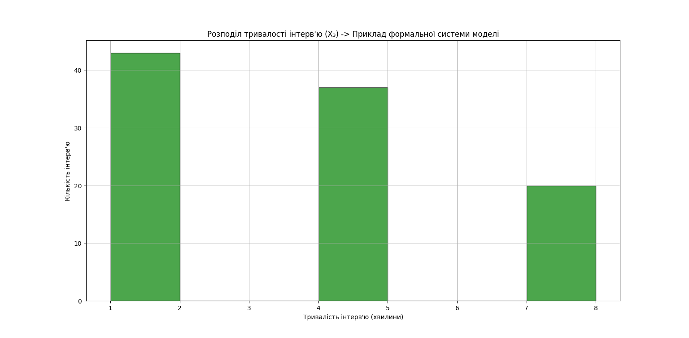
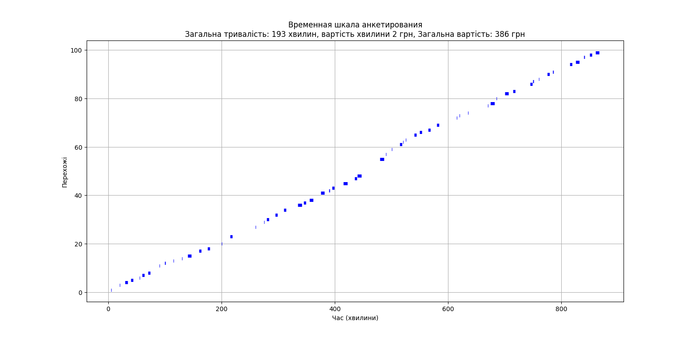

# im_lab_work
Examination work for IM

- [Utils file](utils.py)
- [Main file](main.py)

___

- [Path to output data](../../data/exam/output)

___

- [100 passers-by results](../../data/exam/output/100_results.html)
- [1000 passers-by results](../../data/exam/output/1000_results.html)
- [10000 passers-by results](../../data/exam/output/10000_results.html)

## Formal System Model
|                       Time Allocation                        |                    Duration Allocation                    |
|:------------------------------------------------------------:|:---------------------------------------------------------:|
|  |  |

Simulation Results:

Passers By Dependency:
